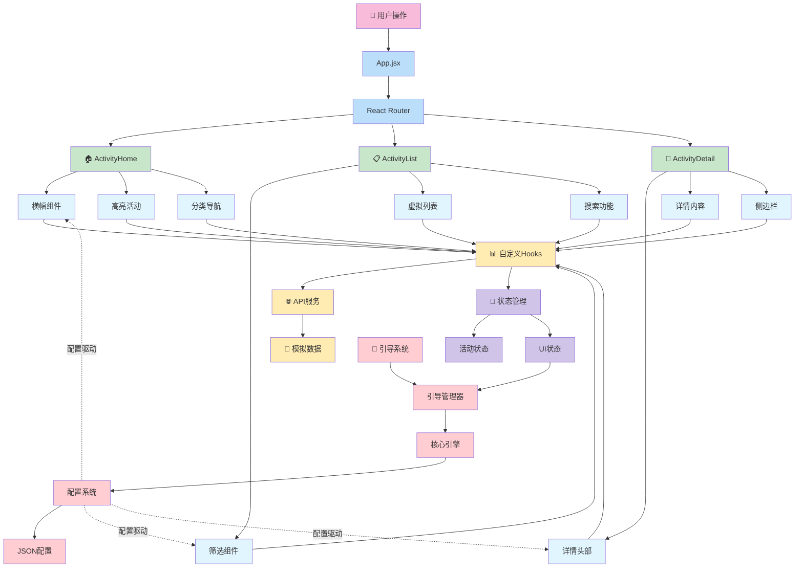
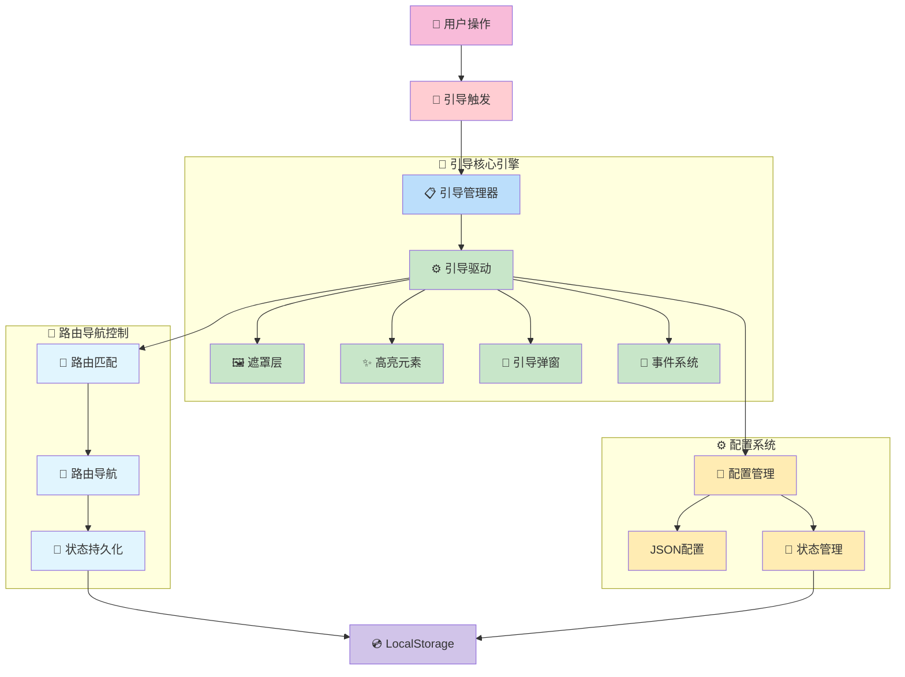
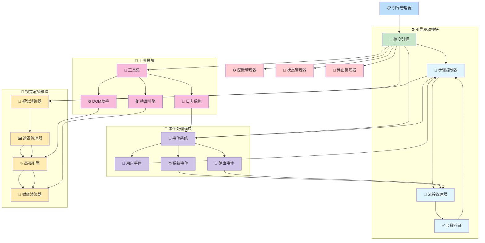
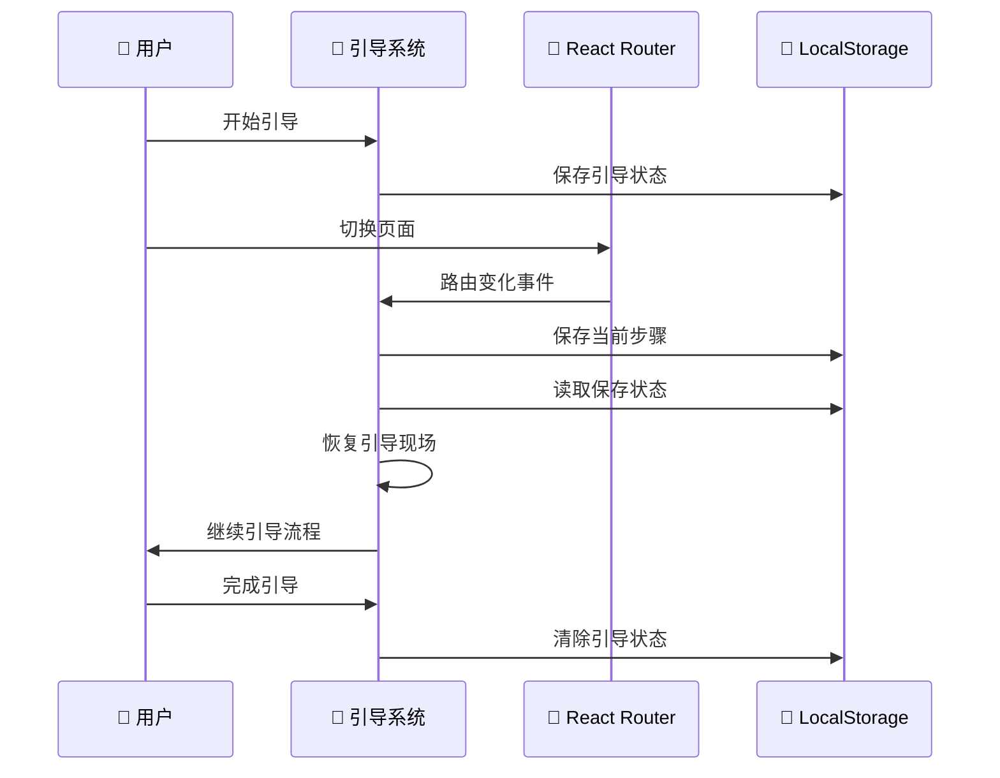
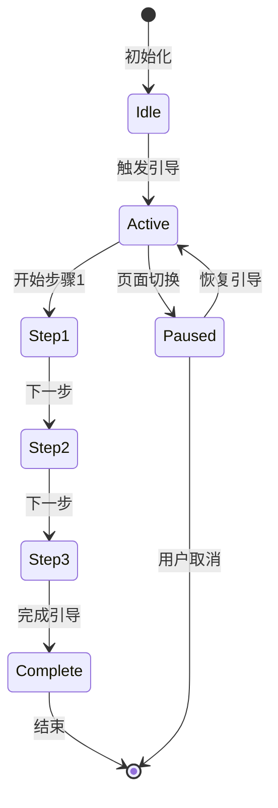

# 字节跳动工程训练营 - 2025 - TikTok

## 📋 项目概述

这是一个基于React的现代化活动管理平台，为字节跳动工程训练营作业设计。平台提供了完整的活动浏览、筛选、详情查看功能，并集成了独立可插拔的新手引导系统，为用户和开发者提供良好的使用体验。

## 🚀 技术栈

| 类别 | 技术选型 | 说明 |
|------|----------|------|
| **前端框架** | React 18.3.1 | 现代化前端框架 |
| **路由管理** | React Router DOM 7.9.6 | 客户端路由管理 |
| **UI组件库** | React Bootstrap 2.10.10 | UI组件库 |
| **状态管理** | Zustand 5.0.8 | 轻量级状态管理 |
| **数据获取** | @tanstack/react-query 5.90.11 | 数据获取和缓存管理 |
| **构建工具** | Vite 7.2.4 | 快速构建工具 |
| **样式框架** | Bootstrap 5.3.8 | CSS框架 |
| **测试工具** | Jest 30.2.0 | 单元测试框架 |
| **代码检查** | ESLint 9.39.1 | 代码质量检查 |
| **数据模拟** | MockJS 1.1.0 | 模拟数据生成 |

## 📁 项目架构概览

### 整体架构图



### 架构分层说明

#### 1. **用户层 (User Layer)**
- 用户操作入口，触发整个应用的数据流

#### 2. **应用层 (Application Layer)**
- App.jsx：应用根组件
- React Router：路由管理，负责页面导航

#### 3. **页面层 (Page Layer)**
- ActivityHome：首页，展示推荐活动
- ActivityList：活动列表页，支持筛选搜索
- ActivityDetail：活动详情页，完整信息展示

#### 4. **组件层 (Component Layer)**
- 业务组件：Banner、Filter、VirtualList等
- 功能组件：搜索、分类、详情展示等

#### 5. **数据层 (Data Layer)**
- 自定义Hooks：业务逻辑复用
- API服务：数据接口调用
- 模拟数据：开发环境数据模拟

#### 6. **状态管理层 (State Layer)**
- ActivityStore：活动相关状态管理
- UIStore：界面状态管理

#### 7. **引导系统层 (Guide Layer)**
- 独立可插拔的新手引导系统
- 配置驱动，与业务逻辑完全解耦

## ✨ 核心亮点

### 🏗️ 现代化架构设计
- **组件化开发**：高度可复用的组件设计，提升开发效率
- **Hook模式**：自定义Hooks实现业务逻辑复用，代码更简洁
- **状态管理**：Zustand轻量级状态管理方案，性能优异

### ⚡ 性能优化
- **虚拟列表**：大数据量下的流畅滚动体验，支持无限滚动
- **数据缓存**：React Query智能数据缓存策略，减少重复请求
- **懒加载**：图片和组件按需加载，提升首屏加载速度
- **骨架屏**：加载状态优化用户体验，避免白屏等待

### 👥 用户体验
- **响应式设计**：完美适配多种设备尺寸，移动端友好
- **平滑动画**：CSS3过渡动画效果，提升交互体验
- **智能筛选**：多维度活动筛选功能，快速定位目标
- **分页加载**：无限滚动分页体验，浏览更流畅

### 🔧 开发体验
- **TypeScript支持**：完整的类型定义，减少运行时错误
- **ESLint配置**：代码质量保证，统一编码规范
- **Jest测试**：单元测试覆盖，确保功能稳定性
- **Mock数据**：开发环境数据模拟，前后端并行开发

### 🎯 功能特性
- **活动浏览**：首页推荐和分类展示，内容丰富
- **智能搜索**：关键词和分类筛选，精准查找
- **详情查看**：完整的活动信息展示，信息全面
- **相关推荐**：智能推荐相关活动，提升参与度

## 🎯 核心功能模块

### 🏠 首页模块 (ActivityHome)
- **横幅展示**：视觉冲击力强的活动推广
- **高亮活动推荐**：精选优质活动展示
- **活动分类导航**：快速定位感兴趣的活动类型
- **最新活动列表**：实时更新的活动信息

### 📋 活动列表模块 (ActivityList)
- **多维度筛选**：分类、时间、状态等多条件筛选
- **虚拟列表展示**：大数据量下的高性能展示
- **搜索功能**：关键词搜索，快速定位目标活动
- **分页加载**：无限滚动，浏览体验更佳

### 📖 活动详情模块 (ActivityDetail)
- **完整活动信息**：活动详情、时间、地点等完整信息
- **相关活动推荐**：智能推荐相似活动
- **参与状态管理**：报名、取消等状态管理
- **分享功能**：便捷的活动分享功能

## 🧭 新手引导系统架构

### 引导系统整体架构



### 核心引擎详细架构



### 核心引擎模块说明

#### 1. **引导驱动模块** ⚙️
- **步骤控制器**：管理当前引导步骤的执行和切换
- **流程管理器**：控制引导流程的整体流转
- **步骤验证**：验证步骤配置的有效性和执行条件

#### 2. **视觉渲染模块** 🎨
- **视觉渲染器**：统一管理所有视觉元素的渲染
- **遮罩管理器**：控制遮罩层的显示和隐藏
- **高亮引擎**：实现目标元素的高亮效果
- **弹窗渲染器**：渲染引导提示信息和操作按钮

#### 3. **事件处理模块** 📡
- **事件系统**：统一的事件分发和处理机制
- **用户事件**：处理用户点击、滚动等交互行为
- **系统事件**：处理页面加载、窗口变化等系统事件
- **路由事件**：监听和响应路由变化

#### 4. **工具模块** 🔧
- **DOM助手**：提供安全的DOM操作和元素查找功能
- **动画引擎**：实现平滑的过渡动画效果
- **日志系统**：记录引导系统的运行状态和错误信息

#### 5. **外部管理器** 🔗
- **配置管理器**：读取和管理引导配置
- **状态管理器**：维护引导状态和进度
- **路由管理器**：处理跨页面引导的导航逻辑

### 架构分层说明

#### 1. **用户操作层**
- 用户交互触发引导流程
- 支持多种触发方式（自动、手动、条件触发）

#### 2. **引导管理层**
- 引导流程的统一管理
- 状态维护和流程控制

#### 3. **核心引擎层**
- **引导驱动**：核心逻辑处理
- **遮罩层**：视觉焦点控制
- **高亮元素**：目标元素突出显示
- **引导弹窗**：提示信息展示
- **事件系统**：用户交互处理

#### 4. **路由控制层**
- **路由匹配**：页面切换检测
- **路由导航**：跨页面引导支持
- **状态持久化**：引导进度保存

#### 5. **配置系统层**
- **配置管理**：引导步骤配置
- **JSON配置**：外部配置文件
- **状态管理**：引导状态维护

#### 6. **持久化存储**
- LocalStorage存储引导进度
- 支持断点续传功能

## ✨ 引导系统核心亮点

### 🎯 完全解耦的架构设计

#### 1. **挂载即用设计** 🚀
- **零配置集成**：无需修改现有业务代码，引入即可使用
- **自动发现**：系统自动识别页面元素和路由结构
- **热插拔支持**：可在运行时动态加载和卸载引导模块

#### 2. **独立架构体系** 🏗️
- **独立状态管理**：拥有专属的状态管理机制，不与业务状态耦合
- **独立配置系统**：基于JSON的配置体系，支持动态更新
- **独立事件系统**：完整的事件驱动架构，避免与业务事件冲突

#### 3. **跨项目复用性** 🔄
```javascript
// 在任何React项目中，只需简单引入
import { GuideManager } from './guide';
import customGuideSteps from './guide-step.json';

// 在React组件中直接使用（无需任何业务逻辑修改）
function App() {
  return (
    <div className="app-container">
      {/* 挂载引导管理器，传入自定义配置 */}
      <GuideManager customGuideSteps={customGuideSteps} />
      
      {/* 其他业务组件 */}
      <YourBusinessComponents />
    </div>
  );
}
```

### 🚀 技术先进性

#### 1. **智能路由感知** 🧭
- **自动路由跟踪**：实时监控React Router变化
- **跨页面引导**：支持多页面连续引导流程
- **状态持久化**：LocalStorage保存引导进度，支持断点续传

#### 2. **配置驱动架构** ⚙️
- **JSON配置**：所有引导步骤通过配置文件定义
- **动态更新**：支持运行时配置热更新
- **多环境适配**：开发/测试/生产环境差异化配置

#### 3. **无侵入式集成** 🛡️
- **DOM操作隔离**：引导系统与业务DOM操作完全隔离
- **样式冲突避免**：使用Shadow DOM或CSS命名空间
- **性能优化**：懒加载引导资源，按需初始化

### 🔄 跨页面引导解决方案

#### 技术架构


#### 核心机制
1. **状态持久化** - LocalStorage存储引导进度
2. **路由监听** - 实时监控页面切换
3. **自动恢复** - 智能检测并恢复中断引导
4. **配置驱动** - JSON配置支持灵活定制

### 📊 引导流程状态管理



## 🛠️ 快速开始

### 环境要求
- **Node.js** >= 16.0.0
- **npm** >= 8.0.0

### 安装步骤

```bash
# 1. 克隆项目
git clone <项目地址>
cd ByteDance-Engineering-Camp

# 2. 安装依赖
npm install

# 3. 启动开发服务器
npm run dev

# 4. 构建生产版本
npm run build

# 5. 运行测试
npm test
```

### 开发命令

| 命令 | 功能 | 说明 |
|------|------|------|
| `npm run dev` | 启动开发服务器 | 支持热重载，默认端口5173 |
| `npm run build` | 构建生产版本 | 优化后的静态文件 |
| `npm run preview` | 预览构建结果 | 本地预览生产版本 |
| `npm test` | 运行测试 | Jest单元测试 |
| `npm run lint` | 代码检查 | ESLint代码质量检查 |

### 项目结构说明

```
src/
├── components/     # 可复用组件
├── pages/         # 页面组件
├── hooks/         # 自定义Hooks
├── services/      # API服务
├── store/         # 状态管理
├── guide/         # 引导系统
└── assets/        # 静态资源
```