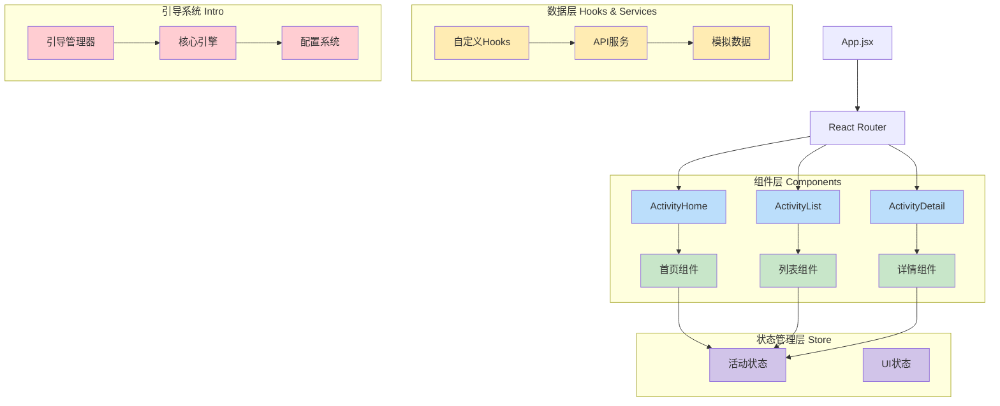
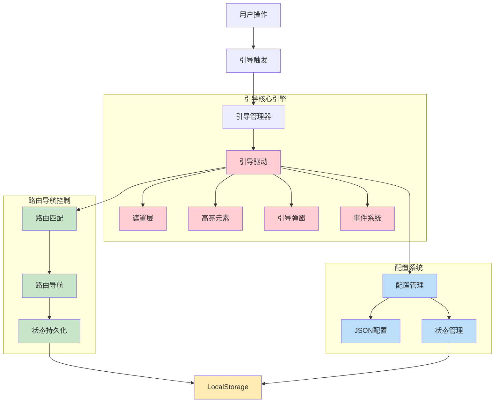
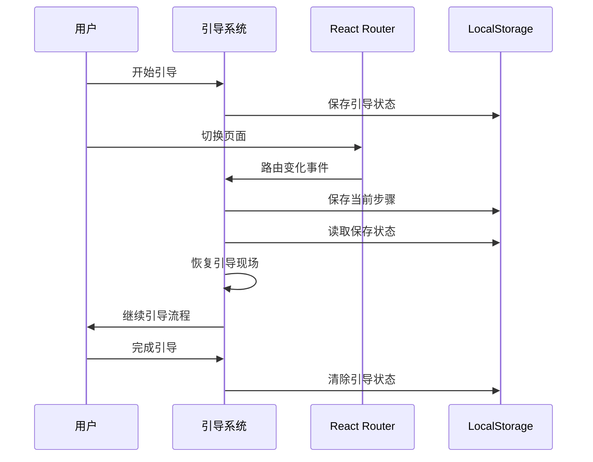
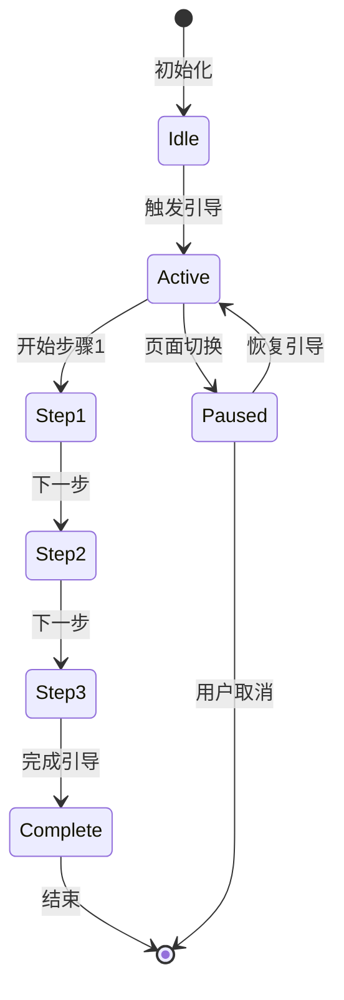

# 字节跳动工程训练营 - 活动管理平台

## 项目概述

这是一个基于React的现代化活动管理平台，为字节跳动工程训练营作业设计。平台提供了完整的活动浏览、筛选、详情查看功能，并集成了智能的新手引导系统，为用户提供流畅的使用体验。

## 🚀 技术栈

### 前端框架
- **React 18.3.1** - 现代化前端框架
- **React Router DOM 7.9.6** - 客户端路由管理
- **React Bootstrap 2.10.10** - UI组件库

### 状态管理
- **Zustand 5.0.8** - 轻量级状态管理
- **@tanstack/react-query 5.90.11** - 数据获取和缓存管理

### 构建工具
- **Vite 7.2.4** - 快速构建工具
- **Babel** - JavaScript编译器

### 样式和UI
- **Bootstrap 5.3.8** - CSS框架
- **CSS3** - 自定义样式和动画

### 测试工具
- **Jest 30.2.0** - 单元测试框架
- **@testing-library/react** - React组件测试

### 开发工具
- **ESLint 9.39.1** - 代码质量检查
- **MockJS 1.1.0** - 模拟数据生成

## 📁 项目架构



## ✨ 项目亮点

### 1. 现代化架构设计
- **组件化开发**：高度可复用的组件设计
- **Hook模式**：自定义Hooks实现业务逻辑复用
- **状态管理**：Zustand轻量级状态管理方案

### 2. 性能优化
- **虚拟列表**：大数据量下的流畅滚动体验
- **数据缓存**：React Query智能数据缓存策略
- **懒加载**：图片和组件按需加载
- **骨架屏**：加载状态优化用户体验

### 3. 用户体验
- **响应式设计**：适配多种设备尺寸
- **平滑动画**：CSS3过渡动画效果
- **智能筛选**：多维度活动筛选功能
- **分页加载**：无限滚动分页体验

### 4. 开发体验
- **TypeScript支持**：完整的类型定义
- **ESLint配置**：代码质量保证
- **Jest测试**：单元测试覆盖
- **Mock数据**：开发环境数据模拟

### 5. 功能特性
- **活动浏览**：首页推荐和分类展示
- **智能搜索**：关键词和分类筛选
- **详情查看**：完整的活动信息展示
- **相关推荐**：智能推荐相关活动

## 🎯 核心功能模块

### 首页模块 (ActivityHome)
- 横幅展示
- 高亮活动推荐
- 活动分类导航
- 最新活动列表

### 活动列表模块 (ActivityList)
- 多维度筛选（分类、时间、状态）
- 虚拟列表展示
- 搜索功能
- 分页加载

### 活动详情模块 (ActivityDetail)
- 完整活动信息展示
- 相关活动推荐
- 参与状态管理
- 分享功能

## 🛠️ 快速开始

### 环境要求
- Node.js >= 16.0.0
- npm >= 8.0.0

### 安装依赖
```bash
npm install
```

### 开发模式
```bash
npm run dev
```

### 构建项目
```bash
npm run build
```

### 代码检查
```bash
npm run lint
```

## 🧭 新手引导系统架构



### 跨页面路由引导解决方案

#### 技术架构


#### 核心机制
1. **状态持久化** - LocalStorage存储引导进度
2. **路由监听** - 实时监控页面切换
3. **自动恢复** - 智能检测并恢复中断引导
4. **配置驱动** - JSON配置支持灵活定制

### 引导流程状态管理



 ## 🎯 技术亮点

 ### 架构优势
 - **模块化设计** - 清晰的职责分离和组件复用
 - **状态管理** - Zustand轻量级状态解决方案
 - **数据缓存** - React Query智能数据管理

 ### 性能优化
 - **虚拟列表** - 大数据量下的流畅体验
 - **懒加载** - 按需加载提升首屏速度
 - **骨架屏** - 优雅的加载状态展示

 ### 引导系统创新
 - **跨页面引导** - 支持多页面无缝引导体验
 - **状态持久化** - LocalStorage确保引导不中断
 - **配置驱动** - JSON配置支持快速定制

 ## 🚀 快速开始

 ### 环境要求
 - Node.js >= 16.0.0
 - npm >= 8.0.0

 ### 开发命令
 ```bash
 # 安装依赖
 npm install

 # 启动开发服务器
 npm run dev

 # 构建项目
 npm run build

 # 运行测试
 npm test
 ```

 ## 📊 项目总结

 本项目成功实现了：

 1. **完整的活动管理功能** - 浏览、筛选、详情查看
 2. **现代化技术栈** - React + Vite + 最新工具链
 3. **智能引导系统** - 创新的跨页面路由引导方案
 4. **优秀的用户体验** - 响应式设计和性能优化

 新手引导系统的跨页面路由解决方案是项目的核心技术亮点，为单页应用的用户引导提供了新的技术范式。