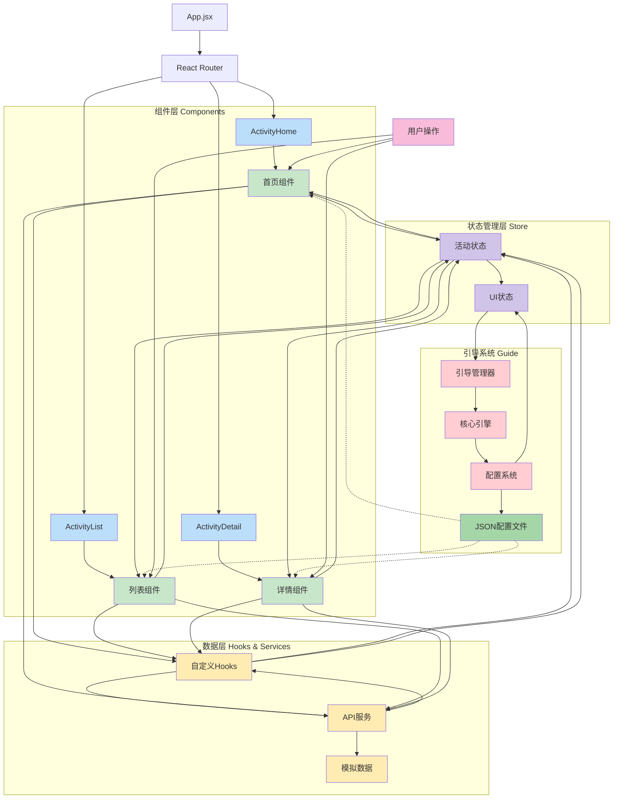
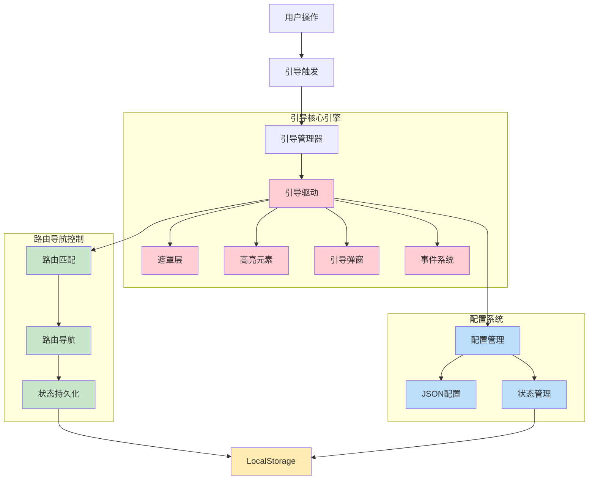
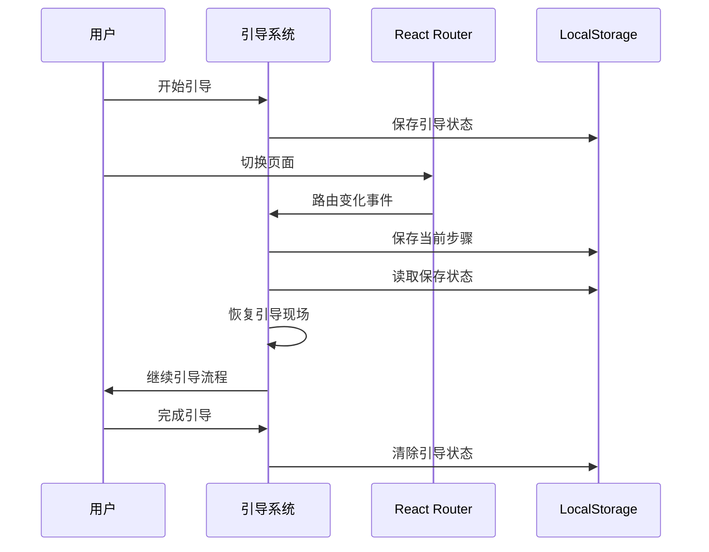
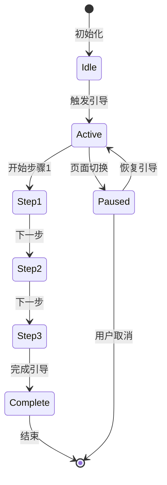

# 字节跳动工程训练营 - 2025 - TikTok

## 项目概述

这是一个基于React的现代化活动管理平台，为字节跳动工程训练营作业设计。平台提供了完整的活动浏览、筛选、详情查看功能，并集成了独立可插拔的新手引导系统，为用户和开发者提供良好的使用体验。

## 🚀 技术栈

### 前端框架
- **React 18.3.1** - 现代化前端框架
- **React Router DOM 7.9.6** - 客户端路由管理
- **React Bootstrap 2.10.10** - UI组件库

### 状态管理
- **Zustand 5.0.8** - 轻量级状态管理
- **@tanstack/react-query 5.90.11** - 数据获取和缓存管理

### 构建工具
- **Vite 7.2.4** - 快速构建工具
- **Babel** - JavaScript编译器

### 样式和UI
- **Bootstrap 5.3.8** - CSS框架
- **CSS3** - 自定义样式和动画

### 测试工具
- **Jest 30.2.0** - 单元测试框架
- **@testing-library/react** - React组件测试

### 开发工具
- **ESLint 9.39.1** - 代码质量检查
- **MockJS 1.1.0** - 模拟数据生成

## 📁 项目一架构 - 活动管理平台



## ✨ 项目一亮点

### 1. 现代化架构设计
- **组件化开发**：高度可复用的组件设计
- **Hook模式**：自定义Hooks实现业务逻辑复用
- **状态管理**：Zustand轻量级状态管理方案

### 2. 性能优化
- **虚拟列表**：大数据量下的流畅滚动体验
- **数据缓存**：React Query智能数据缓存策略
- **懒加载**：图片和组件按需加载
- **骨架屏**：加载状态优化用户体验

### 3. 用户体验
- **响应式设计**：适配多种设备尺寸
- **平滑动画**：CSS3过渡动画效果
- **智能筛选**：多维度活动筛选功能
- **分页加载**：无限滚动分页体验

### 4. 开发体验
- **TypeScript支持**：完整的类型定义
- **ESLint配置**：代码质量保证
- **Jest测试**：单元测试覆盖
- **Mock数据**：开发环境数据模拟

### 5. 功能特性
- **活动浏览**：首页推荐和分类展示
- **智能搜索**：关键词和分类筛选
- **详情查看**：完整的活动信息展示
- **相关推荐**：智能推荐相关活动

## 🎯 核心功能模块

### 首页模块 (ActivityHome)
- 横幅展示
- 高亮活动推荐
- 活动分类导航
- 最新活动列表

### 活动列表模块 (ActivityList)
- 多维度筛选（分类、时间、状态）
- 虚拟列表展示
- 搜索功能
- 分页加载

### 活动详情模块 (ActivityDetail)
- 完整活动信息展示
- 相关活动推荐
- 参与状态管理
- 分享功能

## 🧭 项目二架构 - 新手引导系统



## ✨ 项目二亮点 - 独立可插拔的引导系统

### 🎯 核心优势：业务逻辑完全解耦

#### 1. **挂载即用设计**
- **零配置集成**：无需修改现有业务代码，引入即可使用
- **自动发现**：系统自动识别页面元素和路由结构
- **热插拔支持**：可在运行时动态加载和卸载引导模块

#### 2. **完全独立架构**
- **独立状态管理**：拥有专属的状态管理机制，不与业务状态耦合
- **独立配置系统**：基于JSON的配置体系，支持动态更新
- **独立事件系统**：完整的事件驱动架构，避免与业务事件冲突

#### 3. **跨项目复用性**
```javascript
// 在任何React项目中，只需简单引入
import { GuideManager } from './guide';
import customGuideSteps from './guide-step.json';

// 在React组件中直接使用（无需任何业务逻辑修改）
function App() {
  return (
    <div className="app-container">
      {/* 挂载引导管理器，传入自定义配置 */}
      <GuideManager customGuideSteps={customGuideSteps} />
      
      {/* 其他业务组件 */}
      <YourBusinessComponents />
    </div>
  );
}
```

### 🚀 技术亮点

#### 1. **智能路由感知**
- **自动路由跟踪**：实时监控React Router变化
- **跨页面引导**：支持多页面连续引导流程
- **状态持久化**：LocalStorage保存引导进度，支持断点续传

#### 2. **配置驱动架构**
- **JSON配置**：所有引导步骤通过配置文件定义
- **动态更新**：支持运行时配置热更新
- **多环境适配**：开发/测试/生产环境差异化配置

#### 3. **无侵入式集成**
- **DOM操作隔离**：引导系统与业务DOM操作完全隔离
- **样式冲突避免**：使用Shadow DOM或CSS命名空间
- **性能优化**：懒加载引导资源，按需初始化

### 跨页面路由引导解决方案

#### 技术架构


#### 核心机制
1. **状态持久化** - LocalStorage存储引导进度
2. **路由监听** - 实时监控页面切换
3. **自动恢复** - 智能检测并恢复中断引导
4. **配置驱动** - JSON配置支持灵活定制

### 引导流程状态管理




## 🛠️ 快速开始

### 环境要求
- Node.js >= 16.0.0
- npm >= 8.0.0

### 安装依赖
```bash
npm install
```

### 构建项目
```bash
npm run build
```

### 开发调试
```bash
npm run dev
```